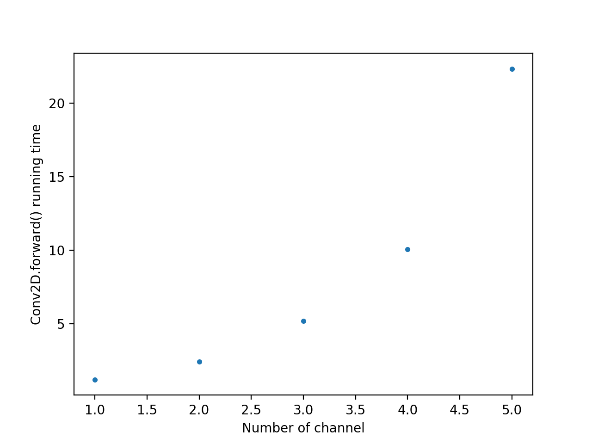
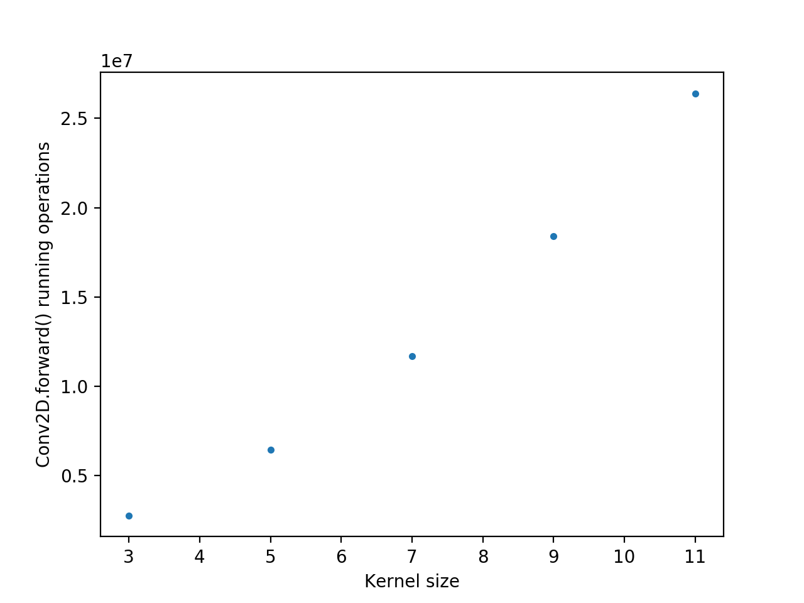

# BME-595 Assignment 01

### Part A

1. Initialize Conv2D in main.py (conv2d = Conv2D(*args)) for one of the task.
2. Call conv2d.forward() with your input image [3D FloatTensor]. The forward() function must return output [int, 3D FloatTensor].
3. Save each channel of output tensor separately as a grayscale image in your main repository.
4. Repeat 2-4 for all the three tasks.

The 12 output images are attached.

Input images:
- test-1920x1080.png
- test-1280x720.png

Output images:
- test-1280x720_3_1_3_1_known_1.png
- test-1280x720_3_2_5_1_known_1.png
- test-1280x720_3_2_5_1_known_2.png
- test-1280x720_3_3_3_1_known_1.png
- test-1280x720_3_3_3_1_known_2.png
- test-1280x720_3_3_3_1_known_3.png
- test-1920x1080_3_1_3_1_known_1.png
- test-1920x1080_3_2_5_1_known_1.png
- test-1920x1080_3_2_5_1_known_2.png
- test-1920x1080_3_3_3_1_known_1.png
- test-1920x1080_3_3_3_1_known_2.png
- test-1920x1080_3_3_3_1_known_3.png

### Part B

1. Initialize Conv2D using values of Task 1 and set o_channel to 2^i (i = 0, 1, …, 10) and mode=’rand’.
2. Plot the time taken for performing each forward() pass as a function of i.

The following is the dot plot:

The figure shows that the running time grows exponentially when the number of channel gets larger.

### Part C

1. Initialize Conv2D using values of Task 2 with kernel_size=3, 5, …, 11 and mode=’rand’.
2. Plot number of operations (int returned by forward()) used to perform convolution as a function of kernel_size.

The following is the dot plot:

The figure shows that the number of running operations is linearly proportional to the kernal size.
